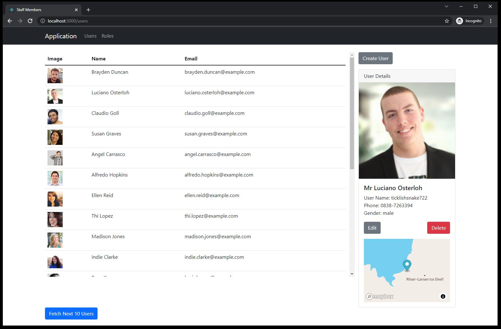
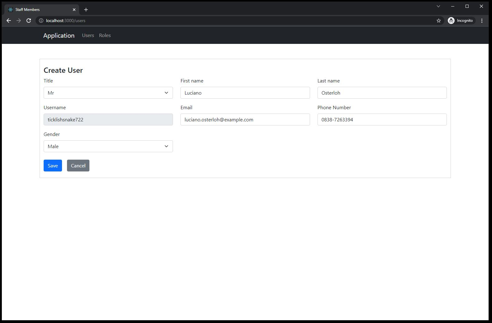
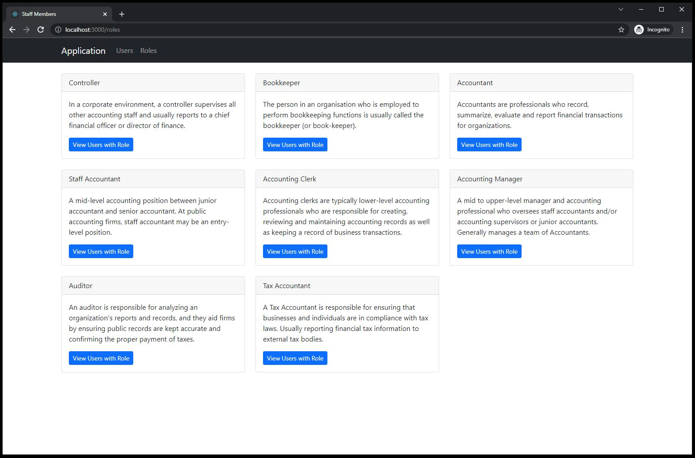

# Users and Roles

A small React JS project with the goal of building something close to the real-world and cover alot of features in React.

The user data is provided by [Random User Generator](https://randomuser.me/)

The MapBox API requires an access token which you can get by signing up to [MapBox](https://www.mapbox.com/). Next set the access token in `UserLocationMap.tsx` 

E.g. `mapboxgl.accessToken = '<API KEY>'`

## Available Scripts

In the project directory, you can run:

### `npm start`

Runs the app in the development mode.\
Open [http://localhost:3000](http://localhost:3000) to view it in the browser.

The page will reload if you make edits.\
You will also see any lint errors in the console.

### `npm test`

Launches the test runner in the interactive watch mode.\

### `npm run build`

Builds the app for production to the `build` folder.\
It correctly bundles React in production mode and optimizes the build for the best performance.

The build is minified and the filenames include the hashes.\
Your app is ready to be deployed!

### `npm run eject`

**Note: this is a one-way operation. Once you `eject`, you can’t go back!**